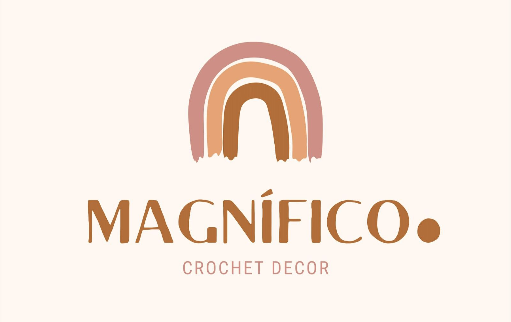

# Sistema de Controle de Vendas- Magnífico Ponto

`Análise e Desenvolvimento de Sistemas - PUC MINAS`

`Eixo 5- Projeto: Desenvolvimento de um Sistema Sociotécnico Inovador`

`5º Semestre`

O projeto propõe o desenvolvimento de uma aplicação Web responsiva e personalizada para a loja Magnífico Ponto, com o objetivo de criar um canal digital eficaz para exposição e venda dos produtos fabricados artesanalmente. Nesse contexto, além de viabilizar a comercialização dos produtos, a aplicação também visa aprimorar a gestão de vendas e o controle de estoque da loja de artesanato. Para garantir uma experiência única, a solução será elaborada oferecendo uma interface intuitiva e funcionalidades específicas adaptadas às necessidades exclusivas da artesã, com o propósito de proporcionar uma experiência de usuário otimizada e satisfatória.

## Integrantes do Grupo

- [Anna Karolina de Souza Freitas](https://github.com/AnnaFreitask)
- [Arthur Hudson Ferreira Machado](https://github.com/Arthurm12)
- [Elder Ferreira Ramos](https://github.com/Elder-Ferreira)
- [Franciele Teixeira Félix](https://github.com/FrancieleFelix)
- [Guilherme Bonfim Lima](https://github.com/bonfimdev)
- [Matheus Fernandes Rosa](https://github.com/mfernandesr)

## Orientador

- Soraia Lúcia da Silva

## Instruções de utilização

Assim que a primeira versão do sistema estiver disponível, deverá complementar com as instruções de utilização. Descreva como instalar eventuais dependências e como executar a aplicação.

# Documentação

<ol>
<li><a href="documentos/01-Documentação de Contexto.md"> Documentação de Contexto</a></li>
<li><a href="documentos/02-Especificação do Projeto.md"> Especificação do Projeto</a></li>
<li><a href="documentos/03-Projeto de Interface.md"> Projeto de Interface</a></li>
<li><a href="documentos/04-Testes de Software.md"> Testes de Software</a></li>
<li><a href="documentos/05-Implantação.md"> Implantação</a></li>
</ol>

# Código

<li><a href="src/README.md"> Código Fonte</a></li>

# Apresentação

O desenvolvimento de um website para a venda de Amigurumis artesanais marca um avanço significativo para a Magnífico Ponto, uma encantadora loja criada e mantida pelas talentosas artesãs mãe e filha, Katia e Karine. Até o momento, a Magnífico Ponto tem utilizado o Instagram como principal canal de vendas, mas a criação de um site próprio tornou-se essencial para profissionalizar e ampliar suas operações comerciais. O novo website não apenas funcionará como uma plataforma abrangente de gerenciamento de vendas, oferecendo um catálogo detalhado dos produtos e um processo de checkout seguro, mas também será totalmente responsivo, proporcionando uma experiência de compra otimizada em computadores e dispositivos móveis. Com essa iniciativa estratégica, almeja-se aumentar significativamente a visibilidade da loja, oferecendo aos clientes uma experiência de compra mais agradável e eficiente. Este projeto está em perfeita consonância com os objetivos de crescimento e profissionalização da Magnífico Ponto, posicionando-a para um futuro de sucesso e expansão.

<li><a href="presentation/README.md"> Apresentação da solução</a></li>
